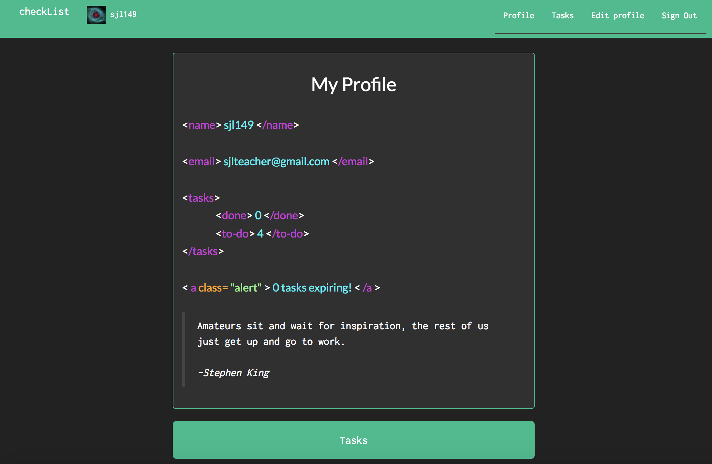
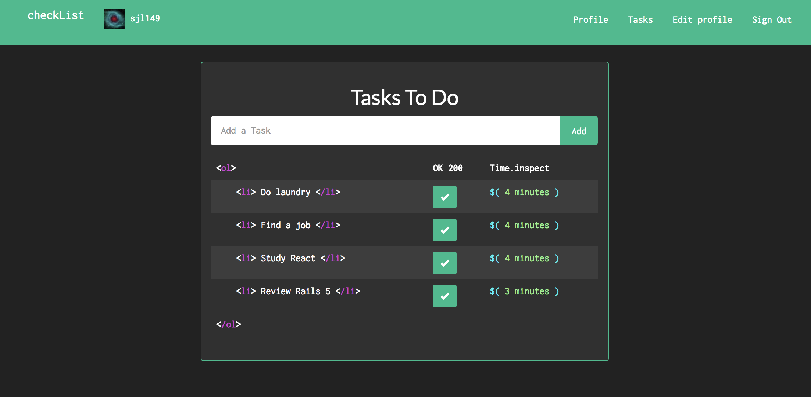

# checkList
#### A creative take on the smart to-do `<ol>`.
Checkout a live preview at [checkList](https://checklist-for-coders.herokuapp.com/).
## Description
Profile page displays number of tasks completed, to-do, and expiring within a day, which should motivate you to get it done or forget about it!

Tasks are added on the task list page. They can be removed by checkbox under `OK 200`. The time remaining is displayed under `Time.inspect` to motivate you to get the task done. So don't wait!

## System dependencies
* [Devise](https://github.com/plataformatec/devise) is used for user authentication.

## Getting Started

This application was built using `rails 4.2.8`.

### Installing

In order to install **checkList** locally:

1. Clone or download this repo.
2. Run `bundle install` to install dependencies
3. Run `rake db:create`, `rake  db:migrate`, and `rake db:seed` to setup the database
4. Run `rails s` and navigate to `localhost:3000` to use in your browser.

### Testing

Tests for the controllers and models are easy to run to ensure all is working.

Simply run `rspec spec/controllers` to run all the tests for controllers. Individual tests can be run with `rspec spec/folder_name/file_name.rb`.

## Authors

**Scott Lenander** - [SJl149](https://github.com/SJl149)

## Acknowledgements

Special thanks to my mentor, Charlie Gaines [beaugaines](https://github.com/beaugaines), and [Bloc](http://bloc.io).
